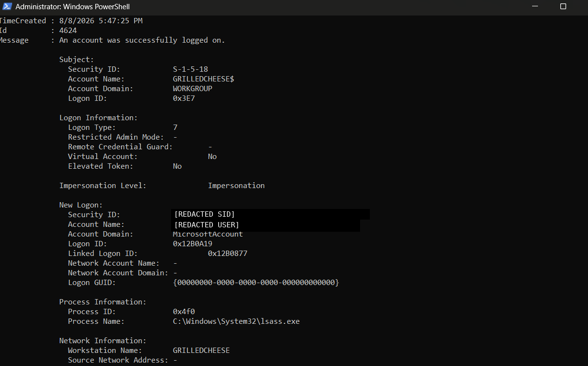

# Windows Authentication Event Log Analysis

**Date:** August 8, 2026

I wanted to get more comfortable reading Windows Security events instead of only memorizing Event IDs, so I used my own Windows machine to look at successful authentication activity.

This was my first time digging into the individual fields closely enough to explain why an event looked normal or suspicious.

## What I used

- Windows Security Event Log
- Event Viewer
- PowerShell
- `Get-WinEvent`

## Starting with the Security log

I first pulled recent Security events:

```powershell
Get-WinEvent -LogName Security -MaxEvents 20
```

Then I filtered for successful logons:

```powershell
Get-WinEvent -FilterHashtable @{LogName='Security'; Id=4624} -MaxEvents 10
```

For more detail:

```powershell
Get-WinEvent -FilterHashtable @{LogName='Security'; Id=4624} -MaxEvents 3 |
Format-List TimeCreated, Id, Message
```

## Events I looked at

### Logon Type 5

One Event ID 4624 had:

- Logon Type: `5`
- New Logon account: `SYSTEM`
- Process: `C:\Windows\System32\services.exe`
- Source Network Address: not recorded

I learned that Type 5 is a service logon. In this case the SYSTEM account and `services.exe` were consistent with normal Windows service activity.

### Logon Type 2

I specifically searched for a Type 2 event with:

```powershell
Get-WinEvent -LogName Security -FilterXPath '*[System[EventID=4624] and EventData[Data[@Name="LogonType"]="2"]]' -MaxEvents 3 |
Format-List TimeCreated, Id, Message
```

The event I reviewed showed:

- Logon Type: `2`
- New Logon account: `DWM-1`
- Domain: `Window Manager`
- Process: `C:\Windows\System32\winlogon.exe`
- Source Network Address: not recorded

This one tripped me up at first.

I originally focused on the account shown under **Subject** and treated it like the user that had logged on. After looking at the event more carefully, I learned that **Subject** describes the account/process requesting or initiating the action, while **New Logon** identifies the account receiving the new logon session.

That distinction made the event make a lot more sense.

### Logon Type 7

I also found a successful Type 7 event tied to my Microsoft account.

Relevant fields were:

- Event ID: `4624`
- Logon Type: `7`
- Domain: `MicrosoftAccount`
- Process: `C:\Windows\System32\lsass.exe`
- Elevated Token: `No`
- Source Network Address: not recorded

Type 7 represents a workstation unlock. The event was consistent with me unlocking my own Windows session.

The screenshot in this repo has the personal account information and SID removed before being published.

## What I took away from this

Before this lab I mostly thought of Event ID 4624 as simply "successful login."

Now I know that isn't enough by itself.

I need to look at the logon type, which account actually received the session, what process was involved, whether a network source was recorded, and whether those details make sense together.

I also learned not to treat a missing source IP as automatic proof that something is safe. In the events I reviewed, the missing network address was consistent with local Windows activity, but the rest of the event still needs to be checked.

## Evidence

Sanitized Event ID 4624 workstation-unlock event:



## Next

Next I want to look at:

- Event ID 4625 failed logons
- repeated authentication failures
- account lockouts
- remote authentication activity
- building a small timeline from related events
- eventually getting Windows logs into Splunk and investigating them there
